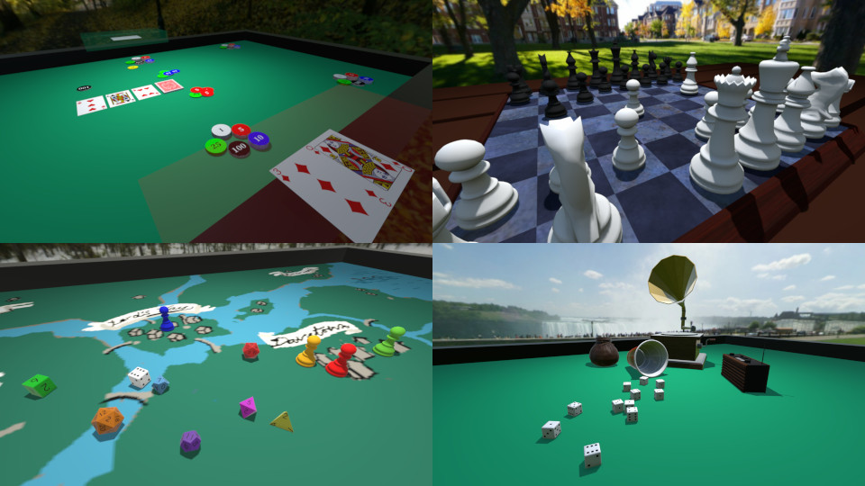

   

Tabletop Club is an open-source multiplayer game that allows you to play your
favourite tabletop games in a physics-driven 3D environment with the use of
easy-to-make
[asset packs](https://tabletop-club.readthedocs.io/en/stable/custom_assets/asset_packs/index.html)!

The game is available on Windows, macOS, and Linux, and is being developed with
the [Godot Engine](https://godotengine.org/).

## Screenshots

  

## Downloading

  
  

To download the game, you can either
[download an official binary](https://tabletop-club.readthedocs.io/en/stable/general/download/downloading_binaries.html)
or
[compile the game from source](https://tabletop-club.readthedocs.io/en/stable/general/download/compiling_from_source.html).

## Community

If you wish to join a growing community of Tabletop Club players, you are always
welcome to the official [Discord](https://discord.gg/GqYkGV4WwX) and
[Matrix](https://matrix.to/#/#tabletop-club:matrix.org) servers!

## Languages

Language             | Game               | Documentation      | Default Asset Pack
-------------------- | ------------------ | ------------------ | ------------------
Chinese (Simplified) | 99%                | :heavy_check_mark: | 99%
English              | :heavy_check_mark: | :heavy_check_mark: | :heavy_check_mark:
Dutch                | :heavy_check_mark: | :x:                | :heavy_check_mark:
Esperanto            | 94%                | :x:                | 99%
French               | 99%                | :x:                | 99%
German               | 99%                | :x:                | 99%
Indonesian           | 55%                | :x:                | :x:
Italian              | 88%                | :x:                | :x:
Norwegian Bokmål     | 99%                | :x:                | 89%
Polish               | 71%                | :x:                | :x:
Portuguese           | 85%                | :x:                | 99%
Russian              | 94%                | 90%                | 82%
Spanish              | :heavy_check_mark: | :heavy_check_mark: | :heavy_check_mark:

If you want to help translate the project, you can go to the project's
[Hosted Weblate](https://hosted.weblate.org/engage/tabletop-club/) page.

You can find out more about contributing translations
[here](https://tabletop-club.readthedocs.io/en/stable/general/contributing/ways_to_contribute.html#translating-the-project).

## Contributing

Want to help contribute to the project? Have a look at the
[ways you can contribute](https://tabletop-club.readthedocs.io/en/stable/general/contributing/ways_to_contribute.html)!

## Documentation

The documentation is hosted on [ReadTheDocs](https://tabletop-club.readthedocs.io/en/stable).
