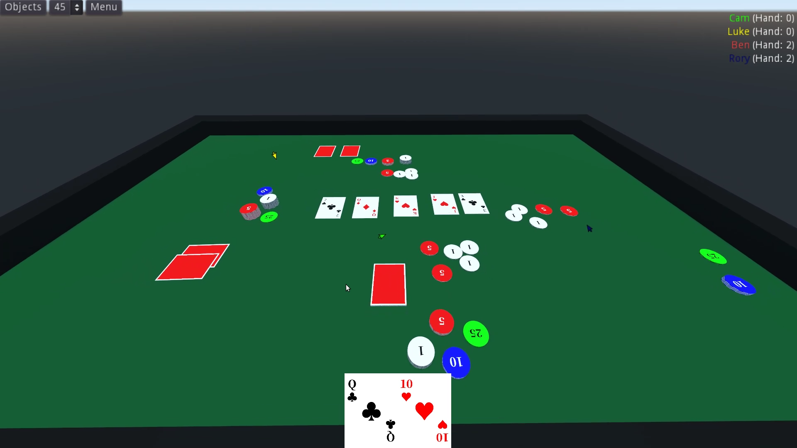

# OpenTabletop

OpenTabletop is an open-source multiplayer game that allows you to play your
favourite tabletop games in a physics-driven 3D environment with the use of
easy-to-make
[asset packs](https://opentabletop.readthedocs.io/en/latest/custom_assets/asset_packs/index.html)!

The game is available on Windows, macOS, and Linux, and is being developed with
the [Godot Engine](https://godotengine.org/).

## Downloading

To download the game, you can either
[download an official binary](https://opentabletop.readthedocs.io/en/latest/general/download/downloading_binaries.html)
or
[compile the game from source](https://opentabletop.readthedocs.io/en/latest/general/download/compiling_from_source.html).

## Contributing

Want to help contribute to the project? Have a look at the
[ways you can contribute](https://opentabletop.readthedocs.io/en/latest/general/contributing/ways_to_contribute.html)!

## Documentation

The documentation is hosted on [ReadTheDocs](https://opentabletop.readthedocs.io).
