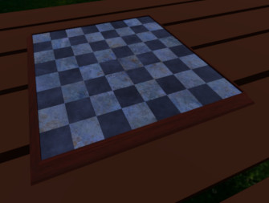
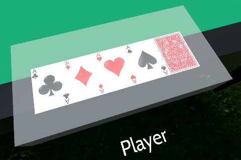
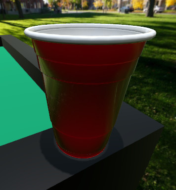
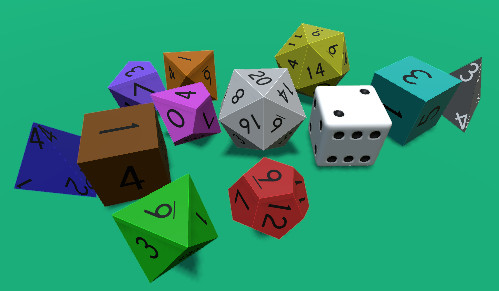
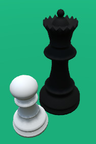
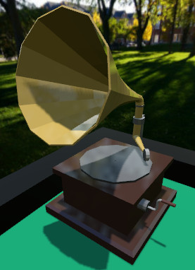
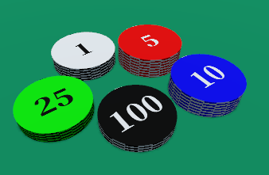

===========
Asset types
===========

.. _asset-type-object:

Object
------

An object in Tabletop Club refers to anything in-game that is dynamic (that is,
it is driven by the physics engine). There are many different types of objects,
each with their own special functionality:

.. _object-type-board:

Board
^^^^^

Boards are generic objects with no special functionality. In this way, they are
equivalent to :ref:`object-type-piece`, with the exception that they are placed
in a separate type in the objects menu.

.. _object-type-card:

Card
^^^^

      hand, from left to right, they are the ace of clubs, the ace of diamonds,
      the ace of hearts, the ace of spades, and a card that is facing down. The
      text "player" is shown in front of the hand.

Cards are flat, rectangular-shaped objects that are stackable, and they have
the unique functionality to be able to be put in a player's hand, where only
the player whose hand it is can see the front face of the card.

Unlike other objects, you need two separate textures for cards - one for the
front face, and one for the back face. The game registers each of the textures
in the ``cards/`` folder as the front face of a card, but you need to tell the
game where to find the back face in the ``config.cfg`` file.

Cards also have a fixed thickness, so you only have to set the width and height
value.

Here is a simple example that will apply a back face texture (in this example,
``BackFace.png``) to all of the cards in the folder:

.. code-block:: ini

   ; cards/config.cfg
   [*]

   ; Width (6.35) and height (8.89) in cm
   scale = Vector2(6.35, 8.89)

   ; Set the back_face for all cards
   back_face = "BackFace.png"

   [BackFace.png]

   ; If we don't ignore the back face, then a card with both sides being the
   ; back face will be imported.
   ignore = true

.. _object-type-container:

Container
^^^^^^^^^

Containers are special objects that can hold an unlimited amount of other
objects inside themselves (including other containers)! Containers are opaque,
meaning you cannot see the objects physically inside of them, but you can peek
inside a container by right-clicking it and pressing :guilabel:`Peek inside`,
which will open a pop-up showing the contents of the container.

Objects can be placed inside a container by touching the container with the
object you want to add, and objects can be randomly removed from the container
by quickly dragging from the container.

Containers can also be configured to drop items out when they are shaken
upside-down by setting ``shakable = true`` in the :ref:`config-cfg` file.

.. _object-type-dice:

Dice
^^^^

Dice are objects that, when shaken, randomize their orientation.

They can also be configured to report certain values depending on their
orientation in the :ref:`config-cfg` file, using the ``face_values`` property:

.. code-block:: ini

   ; dice/d6/config.cfg
   [*]

   face_values = {

      ; This is the format of an entry in face_values:
      ; A number, followed by a semi-colon, followed by a Vector2, with two
      ; numbers inside, followed by a comma if it is not the last entry.
      1: Vector2(0.0, 0.0),

      ; The two numbers inside the Vector2 correspond to the rotation in the
      ; x-axis (left/right), and the z-axis (forward/back), respectively.
      ; If you are not sure what these numbers should be, you can use the
      ; Transform menu in-game to manipulate the dice and find out what the
      ; rotation is for each face of the dice.
      2: Vector2(0.0, 90.0),

      3: Vector2(-90.0, 0.0),
      4: Vector2(90.0, 0.0),
      5: Vector2(0.0, -90.0),
      6: Vector2(180.0, 0.0)
   }

If the face values are configured correctly, then the player will easily be able
to check the total of a set of thrown dice by selecting, then right-clicking the
dice. The total will be shown at the top of the context menu.

If ``face_values`` is not configured, the dice will always report ``0`` as its
value.

.. _object-type-piece:

Piece
^^^^^

Pieces are generic objects with no special functionality.

.. _object-type-speaker:

Speaker
^^^^^^^

Speakers are objects that can play audio tracks. They emit sound positionally,
so the audio will vary depending on the position of the speaker relative to the
camera.

.. _object-type-timer:

Timer
^^^^^

Timers are objects that can be used as countdowns, stopwatches, or to display
the system time. If an audio track is loaded, it will automatically play when
the countdown reaches 0.

.. _object-type-token:

Token
^^^^^

      representing various values, those being 1, 5, 10, 25, and 100.

Tokens are objects that are vertically stackable, meaning they join together
when their top and bottom faces touch, similar to cards.

.. _asset-type-sound:

Sound
-----

Sounds can be played through either a :ref:`object-type-speaker` or a
:ref:`object-type-timer`.

.. _asset-type-music:

Music
-----

Music tracks are the same as sounds, but they can also be configured to play
in the main menu. See the ``main_menu`` property in :ref:`config-cfg`.

.. _asset-type-game:

Game
----

A game is a :ref:`file-type-save` that has been pre-made such that players can
instantly setup the table to play a particular game.

.. note::

   If there is an image next to the save file with the same name, it will be
   shown next to the save file in-game.

.. _asset-type-skybox:

Skybox
------

Skyboxes are special textures that determine what the environment around the
table looks like.

Skybox textures in Tabletop Club use equirectangular mappings, as opposed to
six-image cube mappings. Godot recommends using `this tool
<https://danilw.github.io/GLSL-howto/cubemap_to_panorama_js/cubemap_to_panorama.html>`_
to convert cube-mapped skyboxes to equirectangular skyboxes.

For the best lighting quality, it is recommended to use a HDR panorama.
Tabletop Club supports the Radiance HDR (``.hdr``) and OpenEXR (``.exr``)
formats.

.. note::

   If the skybox is either too bright or too dim, then you can change the
   strength of the ambient light generated by the skybox by setting the
   ``strength`` value in the :ref:`config-cfg` file.

.. _asset-type-table:

Table
-----

A table is a :ref:`file-type-3d` that is placed in the centre of the game world
for players to put objects on.

However, unlike custom objects, the position and scale of the exported model
matters. Keep the following points in mind when you export models to be used as
tables:

* One unit in the exported model = one centimeter (cm) in-game.
* The lowest vertical position the camera can zoom to is ``0`` (this is either
  the y or z axis, depending on the program you're using).

Tables also have a set of hand positions, which are assigned to players by the
server when they join the game. These hand positions can be defined in the
``config.cfg`` file:

.. code-block:: ini

   ; tables/config.cfg
   [Table.gltf]

   hands = [
      ; The first player's hand will be facing forward.
      { "pos": Vector3(0, 5, -50), "dir": 0 },

      ; The second player's hand will be in front of the first player's hand,
      ; but it will be facing backwards.
      { "pos": Vector3(0, 5, 50), "dir": 180 },

      ; The third player's hand will be to the side, facing right.
      { "pos": Vector3(-50, 5, 0), "dir": -90 },

      ; The fourth player's hand will be on the other side, facing left.
      { "pos": Vector3(50, 5, 0), "dir": 90 },

      ; You can add more hand positions here...
   ]

Tables can also be painted on by the players! You can set the size of the area
that the players can paint on by setting the ``paint_plane`` property in the
:ref:`config-cfg` file.
