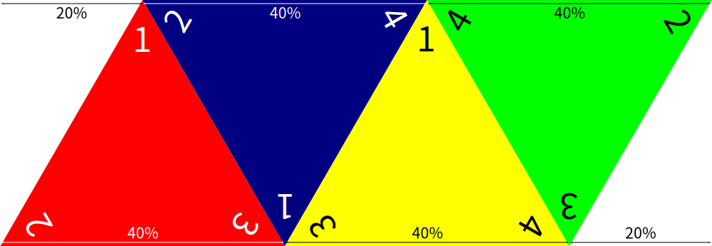
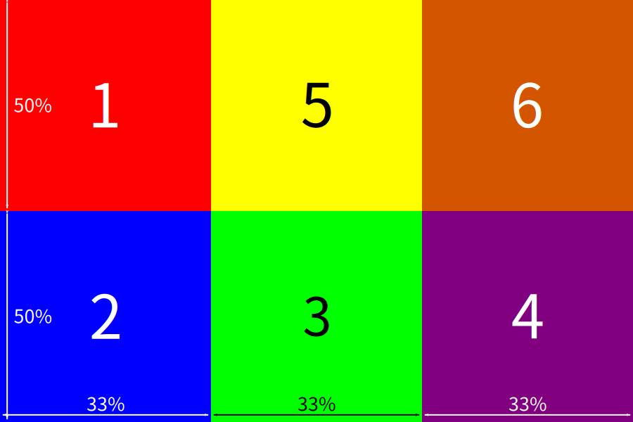

==========
File types
==========

.. _file-type-image:

Image
-----

Supported formats
^^^^^^^^^^^^^^^^^

By default, OpenTabletop supports all of the image formats that Godot supports,
the list of which can be found `here
<https://docs.godotengine.org/en/stable/getting_started/workflow/assets/importing_images.html>`_.

UV Mappings
^^^^^^^^^^^

Every object that uses an image has something called a UV mapping, a way in
which the image is "folded" onto the 3D object. Remember in maths when you had
to "unfold" different shapes into nets? This is essentially the reverse of
that! Knowing these UV mappings is important if you want your object to look
right in-game!

.. note::

   The width and height of the images don't matter, as long as the proportions
   are correct!

Card
""""

.. image:: uv_mappings/card.svg

.. note::

   Unlike other objects, cards use two images, one for each face. See
   :ref:`object-type-card` for more information.

Cube
""""

.. image:: uv_mappings/cube.svg

Cylinder
""""""""

.. image:: uv_mappings/cylinder.svg

Dice - D4
"""""""""

Dice - D6
"""""""""

Dice - D8
"""""""""

.. image:: uv_mappings/d8.svg

.. _file-type-3d:

3D Model
--------

3D models can be exported from almost any 3D modelling software, including
Blender and Maya.

As of right now, OpenTabletop supports the following 3D file formats:

* Collada (``.dae``)
* glTF 2.0 (``.glb``, ``.gltf``)
* Wavefront (``.obj``)

.. note::

   When exporting 3D models with textures, make sure that the textures are also
   in the same folder as the exported model. You may also need to manually edit
   the file to check that the textures are not being loaded with an absolute
   file path, otherwise the textures won't work when the model is imported!

.. _file-type-audio:

Audio
-----

As of right now, OpenTabletop supports the following audio formats:

* MP3 (``.mp3``)
* Vorbis (``.ogg``)
* Waveform (``.wav``)

You can find out which format works best for you in the `importing audio page
<https://docs.godotengine.org/en/stable/getting_started/workflow/assets/importing_audio_samples.html>`_
in the Godot documentation.

.. _file-type-save:

Save File
---------

Save files are used to load back a saved state within OpenTabletop. They use
the ``.table`` extension.

To create a save file when in-game, go to the menu and click
:guilabel:`Save game`, then choose where you want to save the file. You can
then load the state back by clicking the :guilabel:`Load game` button in the
same menu.
